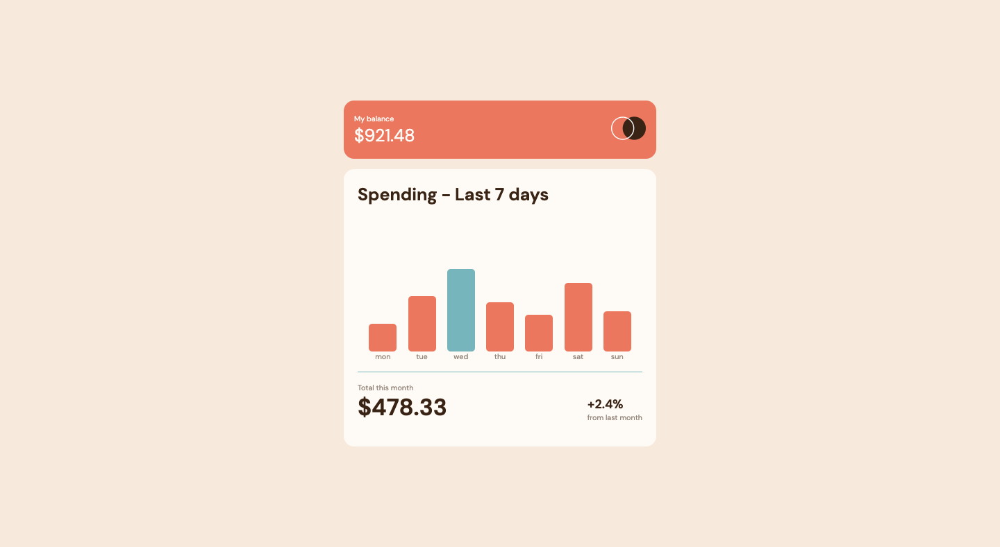

# Frontend Mentor - Expenses chart component solution

This is a solution to the [Expenses chart component challenge on Frontend Mentor](https://www.frontendmentor.io/challenges/expenses-chart-component-e7yJBUdjwt). Frontend Mentor challenges help you improve your coding skills by building realistic projects.

## Table of contents

-    [Overview](#overview)
     -    [The challenge](#the-challenge)
     -    [Screenshot](#screenshot)
     -    [Links](#links)
-    [My process](#my-process)
     -    [Built with](#built-with)
     -    [What I learned](#what-i-learned)
     -    [Continued development](#continued-development)
-    [Author](#author)

## Overview

### The challenge

Your challenge is to build out this bar chart component and get it looking as close to the design as possible.

You can use any tools you like to help you complete the challenge. So if you've got something you'd like to practice, feel free to give it a go.

We provide the data for the chart in a local `data.json` file. So you can use that to dynamically add the bars if you choose.

Users should be able to:

-    View the bar chart and hover over the individual bars to see the correct amounts for each day
-    See the current day’s bar highlighted in a different colour to the other bars
-    View the optimal layout for the content depending on their device’s screen size
-    See hover states for all interactive elements on the page
-    **Bonus**: Use the JSON data file provided to dynamically size the bars on the chart

### Screenshot

### Links

-    Solution URL: [Solution](https://github.com/esdra00/expenses-chart-component-nextjs.git)
-    Live Site URL: [Live Site](https://esdra00.github.io/expenses-chart-component-nextjs/)

## My process

### Built with

-    Semantic HTML5 markup
-    [React](https://reactjs.org/) - JS library
-    [Next.js](https://nextjs.org/) - React framework
-    [Github Pages](https://pages.github.com) - for deployment

### What I learned

### Continued development

## Author

-    Website - [Add your name here](https://www.your-site.com)
-    Frontend Mentor - [@esdra00](https://www.frontendmentor.io/profile/esdra00)
-    Github - [@esdra00](https://github.com/esdra00)
